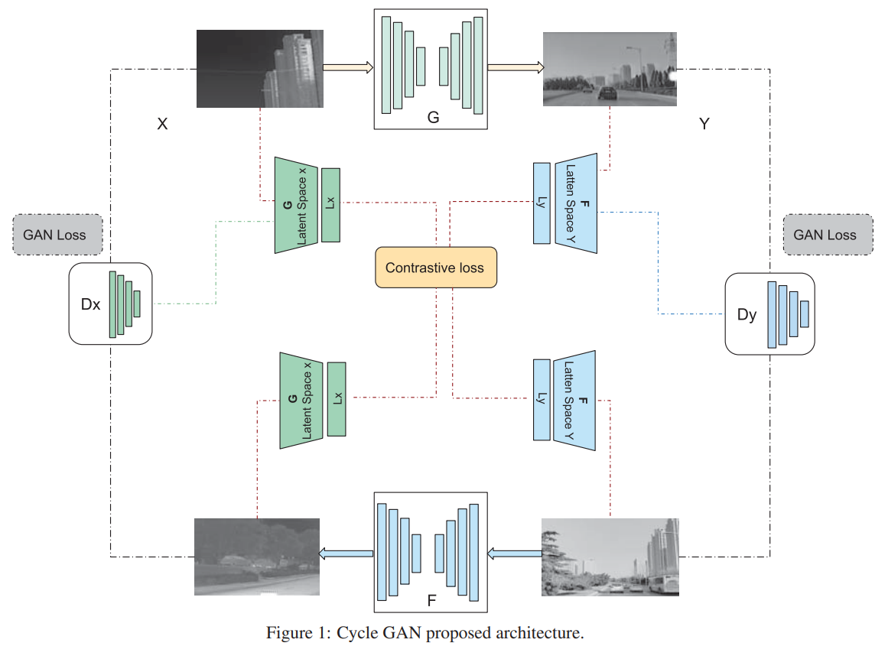
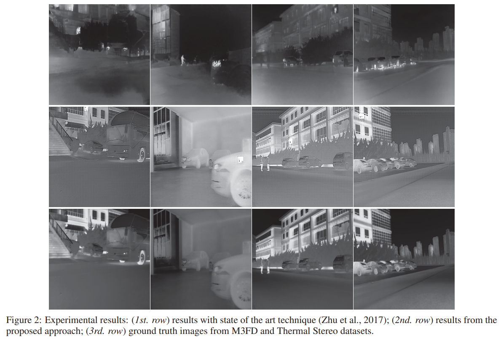
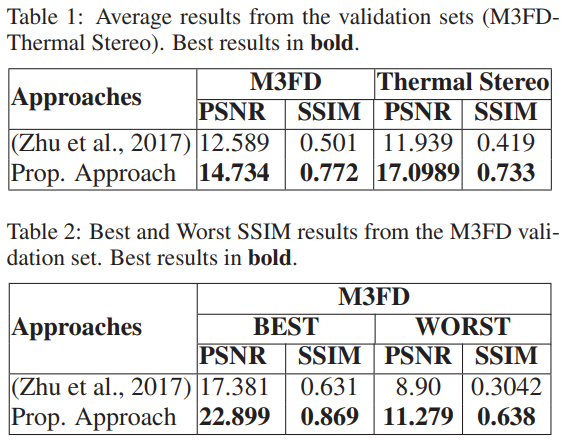

# [Toward a Thermal Image-Like Representation](http://wwwo.cvc.uab.es/people/asappa/publications/C__VISAPP_2023_Vol_4_pp_133-140.pdf) 
This is the official implementation for article "Toward a Thermal Image-Like Representation"
In Proceedings of the 18th International Joint Conference on Computer Vision, Imaging and Computer Graphics Theory and Applications (VISIGRAPP 2023) - Volume 4: VISAPP, pages 133-140

This paper proposes a novel model to obtain thermal image-like representations to be used as an input in any thermal image compressive sensing approach (e.g., thermal image: filtering, enhancing, super-resolution).



## Experimental results
Qualitative results:



Quantitative results:



### Dataset
The dataset used is [M3FD](https://github.com/JinyuanLiu-CV/TarDAL/blob/main/README.md) for training and Thermal Stereo for testing.

### Test
```bash
python test.py --dataroot ./datasets/thermal_stereo --name rgb2thermal
```

### Train
```bash
python train.py --dataroot ./datasets/thermal_stereo --name rgb2thermal 
```

### Pre-trained model
To-Do